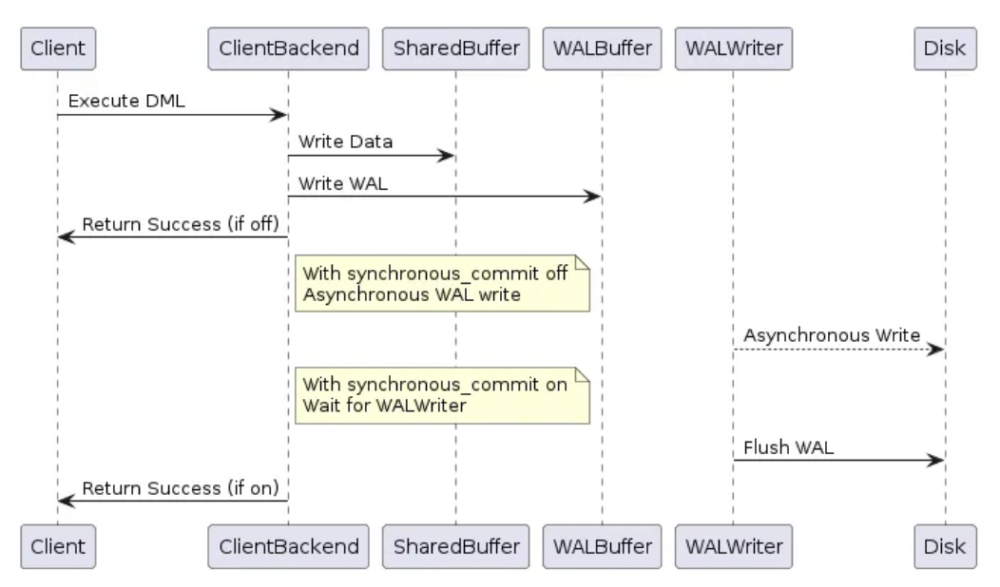
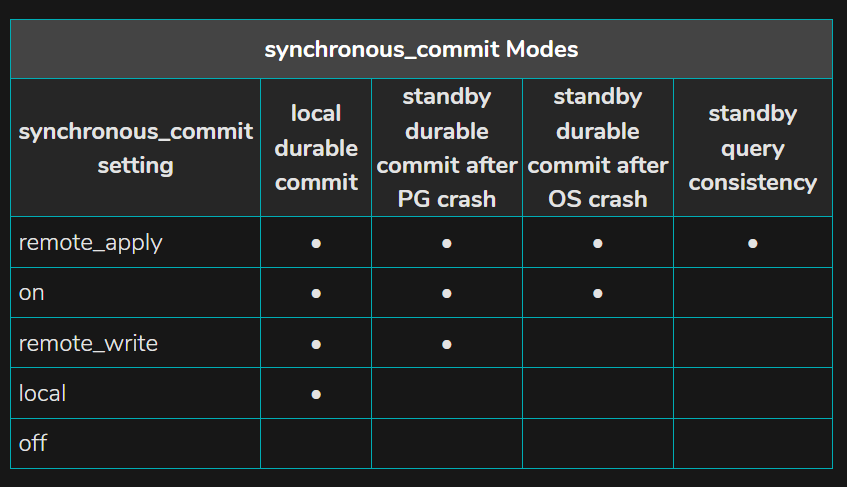
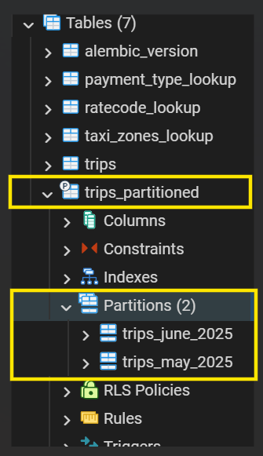

## Table Of Contents:
0. [Week 1 Objectives](#objectives)
1. [Compare Insertion Methods](#part-1)  
2. [WAL Deep Dive](#part-2)
3. [Observability Baseline](#part-3)
4. [COPY with INDEXES](#part-4)
5. [Load FULL Dataset](#part-5)
6. [synchronous_commit](#part-6)
7. [Partitioning](#part-7)

---

## Objectives  
Understand how PostgreSQL handles writes internally - WAL, transactions, commit strategies, and partitioning.  

1. Test **Batch Insert** vs **Row-by-Row Insert** vs **Bulk Streaming**  
2. WAL Deep Dive 
3. Observability Baseline 
4. Indexes and Write Slowdown  
5. Load Full Dataset (~ 4M rows)  
6. `synchronous_commit` Tradeoff  
7. Partitioning by Time 

Week 1 is all about writes : how data gets into PostgreSQL, how WAL records that work, and what the cost of different commit strategies looks like.  

---

### Overview of the stages of a query:  
1. A connection from an application program to the PostgreSQL server has to be established. The application program transmits a query to the server and waits to receive the results sent back by the server.  
    - A supervisor process called `postmaster` and listens at a specified TCP/IP port for incoming connections.  Whenever it detects a request for a connection, it spawns a new backend process.  
2. The parser stage checks the query transmitted by the application program for correct syntax and creates a query tree.  
    - ***Lexer*** is defined in `scan.l` and is responsible for recognizing identifiers, the SQL key words etc. For every key word or identifier that is found, a token is generated and handed to the parser.  
    - ***Parser*** is defined in `gram.y` and consists of a set of grammar rules and actions that are executed whenever a rule is fired. The code of the actions (which is actually C code) is used to build up the parse tree.
    - The parser stage creates a parse tree using only fixed rules about the syntactic structure of SQL. It does not make any lookups in the system catalogs.  
    - The reason for separating raw parsing from semantic analysis is that system catalog lookups can only be done within a transaction, and we do not wish to start a transaction immediately upon receiving a query string.  
3. The rewrite system takes the query tree created by the parser stage and looks for any rules (stored in the system catalogs) to apply to the query tree. It performs the transformations given in the rule bodies.
    - One application of the rewrite system is in the realization of views. Whenever a query against a view (i.e., a virtual table) is made, the rewrite system rewrites the user's query to a query that accesses the base tables given in the view definition instead.  
4. The planner/optimizer takes the (rewritten) query tree and creates a query plan that will be the input to the executor.  
5. The executor recursively steps through the plan tree and retrieves rows in the way represented by the plan. The executor makes use of the storage system while scanning relations, performs sorts and joins, evaluates qualifications and finally hands back the rows derived.  

---

## Part 1
<details>
    <summary>Compare Insertion Methods</summary>

#### GOAL: Batch Insert VS Row-by-Row Insert VS Bulk COPY  

---  
1. **Write-Ahead Logging (WAL)**:
- Sequential record of all changes made to a database
- Mechanism used to ensure data durability, consistency, and recovery in the event of failures 
- Upon transactions, changes are first appended to the WAL file before they are applied to the actual on-disk table data files  (where tables and indexes reside)  
- Enables Point-In-Time Recovery AND Roll-Forward Recovery (also known as REDO)  
- Reduces disk I/O overhead by allowing sequential writes to the log rather than random writes to data files  
---  

2. **Indexes**:
- Similar to *table of contents* for your database
- Specialized data structures (such as B-Trees, Hash indexes, or LSM trees) designed to speed up data retrieval by allowing the database to locate specific rows without scanning the entire table
- Significantly increases read performance
---  

- Yellow Taxi Trip Records : June 2025  
- Parquet <-> CSV   
Though Parquet is optimal choice for big data, Postgres can't load it directly - it loads data row-by-row, which is easier when it is CSV format.  
- Sequential inserts:  
&#9744; No concurrency issues => no deadlocks or transaction conflicts  
&#9744; WAL writing overhead for every insert  
---  

> Data files consist of fixed-size pages (typically 8 kB) that store tables and indexes as arrays of these pages on disk. These files are stored in the database's data directory (often `$PGDATA`).  
8 kB pages structured with a `PageHeaderData` (24 bytes), an array of line pointers (ItemIdData), free space, and heap tuples stored backward from the end.  The `pd_lower` and `pd_upper` fields track free space boundaries. Special space is used by indexes.  

> WAL records are stored as sequential, append-only segment files in the `pg_wal` directory (or `pg_xlog` in versions prior to PostgreSQL 10). By default, each WAL segment file (pre-allocated segment) is 16 MB in size, though this can be configured during cluster initialization. These files have 24-character hexadecimal names.  

To Examine:  
**Data pages**: Use the `pageinspect` extension (page_header(), heap_page_items()).  
```sql
CREATE EXTENSION pageinspect;
SELECT * FROM page_header(get_raw_page('<table_name>', 0));
SELECT * FROM heap_page_items(get_raw_page('<table_name>', 0));
```  
**WAL segments**: Use pg_waldump or pg_walinspect.inspect_wal()  
```sql
CREATE EXTENSION pg_walinspect;
SELECT * FROM pg_get_wal_records_info('start_lsn', 'end_lsn');
SELECT * FROM pg_get_wal_stats('start_lsn', 'end_lsn');
```
---
### Metrics:  
1. Insert Time  
2. WAL Growth  
3. DB Size  
---
> To check **WAL growth**:  
```sql
SELECT pg_current_wal_lsn(); 

---> returns the current WAL LSN (Log Sequence Number) - essentially the "position" of WAL writes at that moment
```
OR 
```sql
SELECT pg_size_pretty(
    pg_wal_lsn_diff(pg_current_wal_lsn(), '0/0')
) AS wal_written;

---> pg_wal_lsn_diff(lsn1, lsn2) calculates the difference in bytes between two LSNs
---> '0/0' is the very start of WAL (since the start of the server)
---> total WAL written = pg_size_pretty() converts the raw byte difference into a human-readable format (e.g., MB, GB)
```  
---
**`Transaction`** is that it bundles multiple steps into a single, all-or-nothing operation.  
When multiple transactions are running concurrently, each one should not be able to see the incomplete changes made by others.  
PostgreSQL actually treats every SQL statement as being executed within a transaction.  

> **Then in such case, due to isolation (AC`I`D), what if Transaction A and B are running concurrently. What if the changes in Transaction B affects the result of Transaction A ? In that case, won't that return stale/old result ?**  
Example:  
Transaction A: Totals the balances in a branch.   
Transaction B: Transfers money between accounts, which changes balances in that branch.  

Databases allow different levels of isolation:  
1. Read Uncommited -> B can see the uncommited changes of A -> can lead to Dirty Reads (wrong values)  
2. Read Commited -> A waits for B to commit changes -> A waits or uses old values  
3. Serializable -> db may block Transaction B until Transaction A finishes  
---
> **What's the difference between BATCH INSERT and BULK COPY?**  

`BATCH INSERT`   
- Client-side Streaming  
- Client can control how many rows to insert per batch  
- Client memory usage matters if batch is very big  
- Batch insert still generates WAL per row in terms of row-level info, but fewer fsyncs or transaction overhead compared to row-by-row  
`fsync = file sync = system call to flush everything in the memory for the file to the disk [happens at commit()]`  
`fsync = durability`   
Every transaction requires the DB to:  
1. Track changes in memory  
2. Write changes to WAL  
3. Ensure atomicity (commit or rollback)  

> Transaction Overhead = Logging transaction begin/commit in WAL + Lock management for concurrent access + Metadata management for rollback and MVCC  

`BULK COPY`   
- Server-side Streaming  
- Data File is streamed directly into Postgres internally 
- Minimal client CPU/memory usage  
- WAL is written efficiently in large sequential chunks (contiguous on disk), not per row
---

### Results:
> ROW WISE INSERTION (100K rows):
Time Taken = 34.02s  
WAL Written = 27 MB  

> BULK COPY (100k rows):
Time Taken = 4.11s  
WAL Written = 22 MB  

For 100k rows, we can clearly see that time taken for bulk copy is almost `~8.5x` faster.  
The WAL written size is not significantly less for bulk copy. 

Now let us imagine there are ~50M rows, then an idealistic estimate would be: 
> ROW WISE INSERTION (50,000k rows):  
Time Taken = 34.02s x 500 = 17010 ≈ 4.7 hours  
WAL Written = 27 MB x 500 ~ 13.5 GB  

> BULK COPY (50,000k rows):  
Time Taken = 4.11s x 500 = 2055 s ≈ 34 minutes  
WAL Written = 22 MB x 500 ~ 11 GB  

So loading ~50M records will take idealistically ~3 mins compared to ~30 mins.  
Now coming to the WAL size, it doesn't shrink as much because PostgreSQL still logs all the data changes (as it should)
but fewer statement-level WAL writes are executed in case of BULK COPY - reducing the overhead. 
</details>

---

## Part 2
<details>
<summary>WAL Deep Dive</summary>
<br>

Earlier we mentioned PostgreSQL actually treats every SQL statement as being executed within a transaction - BUT this is ONLY if autocommit = ON.  
For psycopg2 default = autocommit OFF.  
```python
# subset = 100k rows
for idx, row in subset.iterrows():
    cursor.execute(...)
conn.commit()
```  
Here, execution happens 100k times BUT commit only happens once.  
So in PART 1:  
CASE A
```
execute 100k times => SQL Parsing
commit once => Transaction (containing 100,000 inserts)
```  
This is not the same as:  
CASE B
```
execute
commit
execute
commit
... (x100k)
```  

Now - for CASE B:  
- 100k transaction begin/commit records in WAL
- 100k fsync operations
- 100k durability guarantees

CASE A and B both make 100k network calls/round trips => both make 100k `execute()` calls => CASE B inclues 100k `commit()` calls with it but CASE A makes only 1 at the end.

> COPY avoids  
- network round trips
- per-row SQL parsing + planning
- per-row executor overhead

**_NOTE_** : So in the calculations made in PART 1, we are NOT accounting for all the latencies - that is - latencies caused by Python, Network calls/round trips (Client <-> Server), PostgreSQL execution, Disk (WAL + data).  
> Bulk vs row -> CPU + network + transaction + WAL + parsing  
> `fsync` calls are expensive => Disk I/O is slow.  
> CPU + I/O overhead dominates time  

---

***`TRANSACTION LIFECYCLE`***  
1. **Active State**
    - Modifications made in memory (buffers)
2. **Partially Commited state**
    - Last statement executed successfully -> preparing to make changes permanent
3. **Commited State**
    - Transaction completed successfully -> changes made DURABLE
4. **Failed State**
5. **Aborted/Roll Back State**
6. **Terminated State**
    - Final consistent state post commit or rollback => All resources released (locks, memory,...)  


---

Now let's consider 3 cases instead of 2:
1. Execute + Commit per Row = Worst Case  
2. Execute x100k + Commit Once (Batch) = from Part 1
3. COPY = from part 1

---

> Beyond Just SQL Statement Parsing:  

`SQL parse + plan (happens per statement)`  
- Target table/index pages are located (or loaded) into **shared buffers (PostgreSQL RAM)**  

`Executor overhead (per row)`  
- PostgreSQL evaluates each row, checks types, enforces constraints  
- Corresponding data page is modified in **shared buffers**
- Data Page become **dirty** => not yet persisted on disk  

`WAL Record Generation`  
- PostgreSQL creates a WAL record describing the change  
- Appends it to **WAL buffers (in shared memory = PostgreSQL RAM)**  
- Each WAL record gets a **LSN (Log Sequence Number)**  
- Each modified data page is tagged with that LSN  

__IMPORTANT__: A data page cannot be written to disk unless its WAL (up to that LSN) is persisted

`WAL write + flush (durability boundary)`  
```
    WAL Buffers (PostgreSQL RAM)
                |
            `write()`
                |
    OS Page Cache (Kernel RAM)
                |
            `fsync()`
                |
            Disk (Persistent)
```  

`Data file writes (asynchronous)`  
- Dirty data pages are flushed later by:  
  - background writer  
  - checkpointer  
- Data files may lag behind WAL  
- WAL is the **source of truth for recovery**  


`Network round trips (per execute/commit)`
- every `execute()` (sent by client) involves sending the query + receiving ack/result (sent by server)  

`Client-side Python overhead`  
- iteration, tuple conversion, logging  

> Durability is acheived by persisting the WAL Record - not when the data page is persisted.

**Per-row executor overhead**  
= all the internal work PostgreSQL does to execute a statement for a single row  
= expression evaluation >> data type checks >> constraint checks >> tuple formation >> buffer/page updates >> WAL generation
**Protocol overhead**  
= extra bytes + processing to wrap query/results in PostgreSQL's wire protocol  
= framing/decoding/metadata per message

---
> Major changes from Part 1 to highlight:
- Clearly mention the latencies which are unaccounted for
- WAL size is the wrong metric to check performance of ROW-WISE INSERTION & BULK COPY
---

Depending on your application and objective, you will need to always decide between `speed` or `durability`

### New Metrics  
1. `wal_buffers_full`  
- Number of times WAL buffers filled up -> forcing a flush to OS Page Cache  
- Indicates memory pressure on WAL buffers  
2. `wal_write`  
- Number of `write()` system calls made from WAL buffers to OS Page Cache  
- wal_write can happen even if there is space in WAL buffer - i.e, - they don't necessarily happen only when buffers are full (e.g: commit of a transaction / checkpoint)    
3. `wal_write_time`  
- Time taken to move WAL from Postgres RAM to Kernel/OS RAM  
4. `wal_sync`  
- Number of `fsync()` calls made to flush WAL from Kernel Cache to Disk  
- Critical for durability  
5. `wal_sync_time`  
- Total time spent in fsync() calls  
- Reflects the durable I/O overhead  

> **Checkpoint**: critical internal process which:  
- writes ***dirty pages*** to disk  
- marks a specific LSN -- all WAL up to this point can be considered safe  

So it:  
- reduces recovery time after a crash (PostgreSQL only needs to replay WAL after the last checkpoint)  
- allows WAL files to be recycled (prevents the WAL directory from growing indefinitely)

When it is triggered:  
- Every `checkpoint_timeout` seconds  
- When `max_wal_size` is reached  
- Manually  
- Forced, during server shutdown  

```sql
-- enable wal I/O time tracking + reload the config
-- make sure to set autocommit = true 
ALTER SYSTEM SET track_wal_io_timing = on;
SELECT pg_reload_conf();
-- sys function resets the statistics counters for write-ahead logging (WAL)
SELECT pg_stat_reset_shared('wal');
```

Commands like `ALTER SYSTEM` affect the whole system or shared memory, so PostgreSQL requires them to run outside any transaction block and since Postgres treats every DDL statement as a transaction by default, for such commands, `autocommit` should be enabled. Other examples include `CREATE DATABASE`, `VACCUM FULL`, etc.  

### Results
```
=== CASE A: execute (x100k)  + 1 Commit ===
{'time_sec': 40.8, 'wal_written': '27 MB', 'ini_db_size': '8582 kB', 'db_size': '28 MB', 'wal_buffers_full': 0, 'wal_write': Decimal('197'), 'wal_write_bytes': Decimal('27860992'), 'wal_write_time_ms': 581.06, 'wal_sync': Decimal('0'), 'wal_sync_time_ms': 0.0}

=== CASE B: [execute + commit](x100k) ===
{'time_sec': 75.05, 'wal_written': '62 MB', 'ini_db_size': '8582 kB', 'db_size': '28 MB', 'wal_buffers_full': 0, 'wal_write': Decimal('99927'), 'wal_write_bytes': Decimal('915652608'), 'wal_write_time_ms': 15086.47, 'wal_sync': Decimal('2'), 'wal_sync_time_ms': 88.04}

=== CASE C: BULK COPY (Streaming) ===
{'time_sec': 4.5, 'wal_written': '22 MB', 'ini_db_size': '8590 kB', 'db_size': '28 MB', 'wal_buffers_full': 2317, 'wal_write': Decimal('2418'), 'wal_write_bytes': Decimal('40828928'), 'wal_write_time_ms': 314.58, 'wal_sync': Decimal('1'), 'wal_sync_time_ms': 58.9}
```

---

### Why is `wal_sync = 0` for Case A? (Deferred fsync confusion)

#### Assumption
From the assumptions made about the results based on mental theoritical model: `fsync = durability` and Case B has 100k commits => 100k fsync operations.  
So Case A should have at least **1 fsync** at its single `commit()`.  
Seeing `wal_sync = 0` for Case A looks like a durability gap - as if the committed data was never flushed to disk.

#### Actual Result

| | Case A | Case B | Case C |
|---|---|---|---|
| Transactions | 1 | 100,000 | 1 |
| fsyncs needed | 1 | 100,000 | 1 |
| `wal_sync` observed | **0** | 2 | 1 |
| Durable? | **Yes** | Yes | Yes |

Case B's `wal_sync = 2` is also surprising - 100k commits reduced to just 2 fsyncs.

#### Why it happened

**Case A - `wal_sync = 0`**

`wal_sync` in `pg_stat_io` (PG18) is scoped per `backend_type`. The view tracks fsyncs by the process that issued the `fsync()` syscall - but that process is not always the client session. PostgreSQL has a dedicated **WAL writer background process** (`walwriter`) whose job is to flush WAL to disk periodically and at commit. When the client session commits, it signals the WAL writer, which performs the actual `fsync()`. That call is attributed to the `walwriter` backend type row - not `client backend`.

Since `pg_stat_reset_shared('io')` resets all backend types together, and the measurement window captures what happened *during* the test, the timing matters: if `walwriter` issued its fsync slightly after `end_wal_stats` was captured, the count lands outside the measurement window entirely.

```
Client session (python code) --> commit() --> signals WAL writer --> walwriter process --> fsync() [attributed here, not to client backend]
```

To see it:
```sql
SELECT backend_type, fsyncs, fsync_time
FROM pg_stat_io
WHERE object = 'wal' AND fsyncs > 0;
```
Results:  

|backend_type|fsyncs|fsync_time|
|---|---|---|
|client backend|1|58.902|  

__Note__: for Case C, the fsync shows up under client backend - the client session handled the commit fsync directly since it was a single large transaction. The walwriter attribution applies primarily to Case A's missing fsync.  

**Case B - `wal_sync = 2` instead of 100,000**

PostgreSQL's **group commit** optimization batches multiple concurrent commits into a single fsync. When 100k commits arrive in rapid succession (as in a tight Python loop), the WAL writer groups them and issues one fsync covering all pending WAL records up to the latest LSN. This is `synchronous_commit = on` with group commit doing its job - every transaction still waits for its WAL to be on disk before `commit()` returns, but the actual `fsync()` syscall is shared across the group.

**Case C - `wal_sync = 1`**

COPY is a single transaction. One commit, one fsync. Straightforward. `wal_buffers_full = 2317` shows the WAL buffer filled and was flushed to OS page cache 2317 times mid-stream (these are `write()` calls, not `fsync()` calls - the data was in kernel RAM but not yet on disk). The single fsync at commit made all of it durable in one shot.

#### The corrected mental model

`wal_sync = 0` does **not** mean "not durable". It means the fsync was issued by a background process (`walwriter`), not by the client session directly, and/or landed outside the measurement window.

```
WAL Buffers (PostgreSQL RAM)
            |
        write()   <-- wal_write: attributed to whoever called write()
            |             (could be client backend OR walwriter)
OS Page Cache (Kernel RAM)
            |
        fsync()   <-- wal_sync: attributed to whoever called fsync()
            |             (almost always walwriter, not client backend)
        Disk (Persistent)
```

`wal_write` and `wal_sync` measure **who did the syscall**, not **who triggered it**.

#### Conclusion

- `wal_sync = 0` for Case A is a **measurement attribution artifact**, not a durability gap. The data is durable - the WAL writer performed the fsync on behalf of the committing session.
- `wal_sync = 2` for Case B confirms **group commit** is real and highly effective - 100k logical durability guarantees collapsed into 2 physical fsync calls.
- `wal_sync` as a metric is most useful for understanding **fsync pressure on the WAL writer process**, not for counting per-transaction durability events. For the latter, `wal_write` (write to OS page cache) is the more reliable counter within a measurement window.
- To get a complete picture, always query `pg_stat_io` broken down by `backend_type` - aggregating across all types (as `get_wal_stats()` does) is correct for totals but hides *who* is doing the I/O work.

> **__NOTE__**  
**`walwriter`**  
PostgreSQL has a dedicated background worker - the WAL writer - whose only job is to sit in a loop and flush WAL to disk. Your session posts a request and waits for the WAL writer to confirm it's done.  
**`pg_stat_io`** tracks I/O activity for each type of process separately. `backend_type` is the role indicator here.  


| Process | Role | backend_type |
|---|---|---|
| Our Python Code | Takes orders, runs queries | client backend |
| WAL Writer | Only job: flush WAL to disk | walwriter |
| Background Writer | Flushes dirty data pages | background writer |
| Checkpointer | Periodic full flush to disk | checkpointer |  

Our current get_wal_stats() uses SUM(fsyncs) across all backend_type rows - which - idealistically capture everything.  
BUT:  
The WAL writer is an independent process - it doesn't fsync the moment you commit.  
There's a small delay (walwriter wakes up -> calls fsync() for us -> records fsyncs += 1).  
If our end_wal_stats snapshot is taken before the WAL writer finishes, the fsync lands outside your measurement window.  
***One way to bypass the issue of recording the stats outside the measurement window is to add sleep time.***  
**`Group Commit`**  
Postgres knows fsync is expensive - in order to avoid the obvious fsync delays - it performs group commit.  
This happens when multiple concurrent commits arrive faster than the WAL writer can process them.  
It automatically batches multiple concurrent commits into one fsync, which is why Case B shows 2 fsyncs not 100k.  

(The full explanation for why wal_write_bytes is 15x larger than wal_written is covered in Part 6 - Case B.)  

The approach in PART 1.1 might make up for the unaccounted metrics in PART 1, but it doesn't account for the internal processes handled within Postgres, with the assumption that all activities are initiated and tracked for our Python session only.

</details>

---

## Part 3
<details>
<summary>Observability Baseline</summary>

Postgres devises a ***query plan*** for every query it receives.  
For good performance, choosing the right plan to match the query structure and the properties of the data is absolutely critical.  

1. ### `EXPLAIN ANALYZE`
> #### `QUERY PLANS` 
- The structure of a query plan is a tree of plan nodes  
- Nodes at the bottom level of the tree are scan nodes: they return raw rows from a table  
- There are different types of scan nodes for different table access methods: 
    - `sequential scans` (scans through every page of data sequentially)  
    - `index scans` (uses an index to find either a specific row, or all rows matching a predicate, or scan through a section of the table in order)  
    - `bitmap index scan` (constructs a bitmap of potential row locations. It feeds this data to a parent `Bitmap Heap Scan`, which can decode the bitmap to fetch the underlying data, grabbing data page by page)  

    so on ....

-  If the query requires joining, aggregation, sorting, or other operations on the raw rows, then there will be additional nodes above the scan nodes to perform these operations  

Planning is determining the best arrangement of plan nodes for executing your query and depends on several factors, like:  
1) Sematics of the Query
2) Available Indexes
3) Planner Cost Constants + Resource Consumption Settings
4) Statistics Postgres has collected on your data (either via running ANALYZE manually OR as a part of manual/auto VACCUM)

Reading Query Plans: 
1) Identify the Leaf Nodes
2) Evaluate Each Node's Purpose
3) Move Up the Tree till the ROOT node

> #### `PLAN NODES`  
Understanding the behavior and performance of individual plan nodes (and when Postgres chooses them for a plan) is critical to understanding overall query planning.

Node types can be broadly considered in three categories:  
- Scan Nodes =  Produce rows from underlying table data
- Join Nodes = Combine rows from child nodes
- Other Nodes = Broad variety of functionality (e.g. aggregation, limiting, grouping, etc)  

> #### `COST METRICS`  
`(cost=0.00..3474.00 rows=99140 width=139) (actual time=0.015..9.287 rows=99978.00 loops=1)`

Here,  
- Cost enclosed in the 1st parantheses (leftmost) indicates the estimates ONLY
- Cost enclosed in the 2nd parantheses (rightmost) indicates the actual values

ESTIMATES:   
`cost=0.00..3474.00` = Estimated start-up cost .. total cost  
`rows=99140` = Estimated # of rows by that node  
`width=139` = Average width of rows output (in bytes)  

- The costs here aren't estimated time taken. They are measured in arbitrary units determined by the planner's cost parameters.  
- Traditional practice is to compute estimated costs as :   
`(disk pages read * seq_page_cost) + (rows scanned * cpu_tuple_cost)`  
By default, seq_page_cost is 1.0 and cpu_tuple_cost is 0.01.

`seq_page_cost` : planner's estimate of the cost of a disk page fetch that is part of a series of sequential fetches  
`cpu_tuple_cost`: planner's estimate of the cost of processing each row during a query  

Let's try to calculate the approx. value: 
``` 
disk pages read = 2224 (from `pg_class` catalog)  
seq_page_cost = 1.0  
rows scanned = 99140  
cpu_tuple_cost = 0.01  

Our Estimate = (2224 * 1) + (99140 * 0.01) = 3215.4  
Actual Estimate = 3474.00  
Difference ~ (-) 7.44% from Actual Estimate  
```

ACTUAL:  
`actual time=0.015..9.287` = Time to get the 1st row .. Time to get the last row ***~ 9ms***  
`rows=99978.00` = Actual # of rows returned by that node  
`loops=1` = # of times the node was executed  

- In case a node was executed more than once, then the `actual time` would be an average of each iteration - which is then multiplied by the number of times the node was executed.  
- Since `cost` (arbitrary units) and `actual time` (ms) can't be compared, `rows` estimated and the actual count are one of the metrics that can be used to compare.  

> #### `EXPLAIN` and `EXPLAIN ANALYZE`  
***EXPLAIN*** command gives the execution plan for a query without actually running it. Insights returned are ESTIMATES.  
***EXPLAIN ANALYZE*** command does everything that ***EXPLAIN*** does, but it also executes the query, showing the actual time taken for each operation. Insights returned include ESTIMATES and ACTUAL METRICS.  
It also shows additional execution statistics on top of the costs. For example,  
- Sort node provides extra info on which sort method was used, whether the sort was in-memory or on-disk and the amount of disk space needed.
- Hash node shows the number of hash buckets and batches, as well as the peak amount of memory used for the hash table.  

Both commands accept `DQL` (***SELECT***) and `DML` (***INSERT***, ***DELETE***, ***UPDATE***, ***MERGE***) statements.  

The output of ***EXPLAIN*** has one line for each node in the plan tree, showing the basic node type plus the cost estimates that the planner made for the execution of that plan node.  
The cost of an upper-level node includes the cost of all its child nodes.  

The `BUFFERS` option, along with `ANALYZE`, for `EXPLAIN` command additionally shows the details of how much data is being loaded from the disk and the Postgres shared buffer cache.  

***LIMITATIONS:***  
It's important to understand that the cost returned reflects only the things that the planner cares about and can control/optimize.  
For instance, the planner doesn't consider the time spent to convert o/p values to text format (***`I/O Conversion Costs`***), unless ***SERIALIZE*** is specified OR to transmit them to the client (***`Network Transmission Costs`***) - which could have a significant impact on real elapsed time - but they are costs that the planner can't change/optimize by altering the plan.  

> #### `STATISTICS USED BY THE PLANNER`  
`How/On what basis are the estimates calculated for EXPLAIN?`  

***Statistics Used by the Planner:*** 
1. One component of the statistics is the total number of entries in each table and index + the number of disk blocks occupied by each table and index.  
This info can be accessed from table `pg_class` in `reltuples` and `relpages` columns.  

```sql
select relkind, reltuples, relpages from pg_class where relname='trips';
```  
|relkind|reltuples|relpages|
|---|---|---|
|r|100000|2224|  

2. The catalog `pg_statistic` or `pg_stats` stores statistical data about the contents of the database.  
Entries are created by ANALYZE and subsequently used by the query planner.  
Note that all the statistical data is inherently approximate, even assuming that it is up-to-date.  

```sql
SELECT
    n_distinct,
    correlation,
    most_common_vals,
    histogram_bounds
FROM pg_stats
WHERE tablename = 'trips'
AND attname = 'tpep_pickup_datetime';
```

`histogram_bounds`:  
- bucketed distribution of values across the column, so it knows roughly how many rows fall in each range  
- histogram bounds are only created when:  
    - The bucket contains at least two distinct elements  
    - The values are not in the MCV (most common values) list  
- By default PostgreSQL creates 100 buckets  
- The accuracy of the estimate depends on how fresh the histogram is and how evenly data is distributed across buckets  

`correlation`:  
- how physically ordered the data is on disk (1.0 = perfectly ordered, 0 = random)  
- Relevant for index efficiency  

> #### `TRY`

```sql
EXPLAIN (ANALYZE, BUFFERS)
SELECT * FROM trips WHERE tpep_pickup_datetime > '2025-06-01';
```  

Results:  
```
"QUERY PLAN"
"Seq Scan on trips  (cost=0.00..3474.00 rows=99140 width=139) (actual time=0.015..9.287 rows=99978.00 loops=1)"
"  Filter: (tpep_pickup_datetime > '2025-06-01 00:00:00'::timestamp without time zone)"
"  Rows Removed by Filter: 22"
"  Buffers: shared hit=2224"
"Planning Time: 0.087 ms"
"Execution Time: 11.674 ms"
```  

- PostgreSQL scanned the entire table row by row. No index was used.  
- Out of 100,000 rows, only 22 didn't match the filter. So almost every row in the table matched - which is exactly why PostgreSQL chose a sequential scan. Because Index Scan is used when table needs to be filtered out partially.  
- All 2,224 pages needed were already in PostgreSQL's shared memory (RAM). Nothing had to be read from disk.

---
2. ### `pg_stat_activity`
Shows all currently active connections and what they're doing.  

```sql
SELECT pid, state, query, wait_event_type, wait_event
FROM pg_stat_activity
WHERE datname = 'trips';
```

---
3. ### `pg_stat_user_tables`
Shows per-table stats -> rows inserted, rows dead (not yet vacuumed), sequential scans vs index scans.  

```sql
SELECT relname, n_live_tup, n_dead_tup, seq_scan, idx_scan
FROM pg_stat_user_tables
WHERE relname = 'trips';
```

|relname|n_live_tup|n_dead_tup|seq_scan|idx_scan|
|---|---|---|---|---|
|trips|100000|0|55|3|

***seq_scan = 55:***  
- The table has been sequentially scanned 55 times  
- This includes all the queries = the planner gathering statistics, and internal operations  
- Every time PostgreSQL read the whole table, it counted here  

***idx_scan = 3:***  
- Only 3 index scans  
- This is just the primary key (trip_id) being used a handful of times internally (since none are explicitly created yet)  
---
4. ### `pg_stat_io` 
(Already tried this out during `WAL Deep Dive`)
</details>

---

## Part 4
<details>
<summary>Add Indexes</summary>

As a rule of thumb, indexes should be on any fields that you use in JOIN, WHERE or ORDER BY clauses (if they have enough different values to make using an index worthwhile, field with only a few possible values doesn't benefit from an index which is why it is pointless to try to index a bit field).  
Indexes are a balancing act, every index you add usually will add time to data inserts, updates and deletes AND also increase table size - but - can potentially speed up selects and joins in complex inserts, updates and deletes.  

As an experiment, I created indexes on these columns:  
- tpep_pickup_datetime (useful when we query over trips in a certain DTT range)  
- pu_location_id (query all trips based on pickup zones)  
- total_amount (query trips which fall in the range of a certain amount)

Expectation:  
- Time taken will increase significantly  
- More WAL Records (additional for indexes)  
- More times WAL Shared Buffers Full (more info) -> More WAL Write Time  

COPY 100k with INDEXES:  

```
{'time_sec': 4.87, 'wal_written': '43 MB', 'ini_db_size': '8630 kB', 'db_size': '34 MB', 'wal_buffers_full': 4561, 'wal_write': Decimal('4567'), 'wal_write_bytes': Decimal('45006848'), 'wal_write_time_ms': 451.58, 'wal_sync': Decimal('0'), 'wal_sync_time_ms': 0.0}
```  

|Metric|COPY (no indexes)|COPY (with indexes)|
|---|---|---|
|time_sec (s)|4.5|4.87|
|wal_written (MB)|22|43|
|wal_write|2418|4567|
|wal_buffers_full|2317|4561|
|wal_write_time_ms|314.58|451.58|
|wal_sync_time_ms|58.9|0.0|
|db_size (MB)|28|34|  

|Metric|~ Change|
|---|---|
|time_sec (s)|+8%|
|wal_written (MB)|+95%|
|wal_write|+88%|
|wal_buffers_full|+97%|
|wal_write_time_ms|+44%|
|db_size (MB)|+21%|

Insights:  
- As opposed to expectation of time taken, the difference in total time taken is insignificant i.e., there's very little difference (~ 0.4 s)  
- But as expected:
    - WAL Records written are more (~ 95%) => nearly doubled  
    - In turn, so are the wal write() calls (~ 88%) and # of times WAL buffers were flushed (~ 44%)

> ***Why ?***  

When you insert a single row without indexes, Postgres does:  

`insert 1 row into table page ---> write 1 WAL record`  

But with indexes:  
```
insert 1 row into table page    ---> write WAL record
update idx_pickup_datetime      ---> write WAL record
update idx_pickup_zone          ---> write WAL record
update idx_total_amount         ---> write WAL record
```  
So that's 3 extra WAL entries being made.  
Every index is a separate data structure (a B-Tree) that must be kept in sync with the table on every insert.  
Each update to each B-Tree generates its own WAL records.  
That's ***`write amplification`*** => one logical write (insert a row) causes multiple physical writes.  
Maybe that extra 6 MB in db_size amounts to the index structures sitting on the disk.  

As for the total time difference, I am not sure of the cause yet.  

</details>

---

## Part 5
<details>
<summary>Load Full Dataset</summary>
<br>

***Total Rows = 4322960 ~ 4.3 Million***

> Without Indexes:  

{'time_sec': 190.61, 'wal_written': '926 MB', 'ini_db_size': '8606 kB', 'db_size': '824 MB', 'wal_buffers_full': 95262, 'wal_write': Decimal('95510'), 'wal_write_bytes': Decimal('1054892032'), 'wal_write_time_ms': 12195.81, 'wal_sync': Decimal('5'), 'wal_sync_time_ms': 49.46}

> With Indexes:  

{'time_sec': 223.91, 'wal_written': '1909 MB', 'ini_db_size': '8646 kB', 'db_size': '1042 MB', 'wal_buffers_full': 91682, 'wal_write': Decimal('92556'), 'wal_write_bytes': Decimal('2004828160'), 'wal_write_time_ms': 14794.85, 'wal_sync': Decimal('0'), 'wal_sync_time_ms': 0.0}

|Metrics|Without Indexes|With Indexes|
|---|---|---|
|time_sec|190.61|223.91|
|wal_written (MB)|926|1909|
|db_size (MB)|824|1042|
|wal_buffers_full|95262|91682|
|wal_write|95510|92556|
|wal_write_time_ms|12195.81|14794.85|
|wal_sync|5|0|
|wal_sync_time_ms|49.46|0|

> Comparing TIME with 100k rows:  

||100k|4.3M|~ Change|
|---|---|---|---|
|without|4.5|190.61|41x|
|with|4.87|223.91|45x|

> Observations:  

- For 100k rows, time_sec difference was ~ 0.37s - which was pretty insignificant.  
But with 4.3M rows, the difference is ~ 33s.  
- The WAL records written or WAL entries made are as expected more for COPY with INDEXES (~ 1.06x more) - nearly as it's double.  
This sticks to the concept of row-wise WRITE AMPLIFICATION - which is regardless of the dataset size.  
- Similarly, the db_size is significantly more for WITH INDEXES. For 100k, we assumed that the extra 6 MB was used to store the index structures on disk. Going by that an estimate for 4.3M rows would be:  
    `(4.3M rows / 100k rows) x 6 MB` ~ `260 MB`  
    So around 260 MB must have been for index structures for loading the full dataset.  
    Now, if we actually check the difference in actual db_size values for full dataset:  
    `db_size(4.3M) - db_size(100k)` = `218 MB`  
    Then there's an difference of `~ 19 %` from value derived from calculations and actual value.  

- Coming to `wal_buffers_full` and `wal_write` metrics are diffrent from what I expected.  
The values for WITH INDEXES are lesser by `approx 4% and 3%` respectively.  
- At the same time `wal_write_time_ms` is `~ 21 %` more for WITH INDEXES.
- The fsync() calls made and the time taken to complete those system calls to persist in the disk are both 0 for WITH INDEXES. What does that mean ?  

> Breaking it down:  

- If the WAL shared buffers get full more times, then more it has to be flushed and written to the Kernel/OS Cache using write() system calls.  
That means, if the `wal_buffers_full` is more, then consequently `wal_write` has to be more as well.  
This sticks to the observations made. Both those metrics are positively correlated.  
- Now coming to the time taken to complete all those write() sys calls - let's assume that the time taken to complete a write() call after a buffer is full is more or less constant. Then if more times the buffers were full, then the more write() calls are made, hence increasing the `wal_write_time_ms` as well.  
But observations made say a completely different story.  

> Why ?  
1. 19% index storage difference:  
-  It is reasonable and acceptable as index doesn't exactly scale linearly with rows - since - it involves B-Trees, which might have a little bit of overhead.  

2. `wal_sync` and `wal_sync_time_ms` both 0 for WITH INDEXES:  
- Might be the same issue as what we faced in PART 2 [WAL DEEP DIVE] - it might be WAL writer attribution issue.  
-  The fsync() happened, just outside our measurement window or attributed to the walwriter process.  

3. [`wal_buffers_full`, `wal_write`] and `wal_write_time_ms` anamoly:  
- Firstly, I assumed that time per each write() call is constant.  
But in reality, time taken to execute each write() call depends on how much data is being pushed.  
- Secondly, I overlooked and completely ignored another metric which was included - i.e. - `wal_write_bytes`

Let's compare the difference for `wal_write_bytes`:  

||100k|4.3M|~ Change|
|---|---|---|---|
|without|4.5|1054892032|41x|
|with|4.87|2004828160|45x|  

This is aligned with another observation which we already vouched for, i.e., # of WAL records is double when it comes to WITH INDEXES (additional WAL records for each of the 3 indexes).  

> Let us check exactly how much data does each flush roughly carry ?  

***Without Indexes:***  
```
WAL Buffers got full = 95262 times  
write() calls for WAL buffer flushes = 95510 times  
Total bytes written by write() calls = 1054892032 ~ 1054 MB

Amount of data per flush = total_bytes / # of flushes  
                         = 1054 / 95510 = 0.011 MB  
                         ~ 11 KB per flush  
Time per flush = total_wal_write_time / # of write() calls  
               = 12195.81 / 95510  
               ~ 0.128 ms per wirte() call               
```

***With Indexes:***  
```
WAL Buffers got full = 91682 times  
write() calls for WAL buffer flushes = 92556 times  
Total bytes written by write() calls = 2004828160 ~ 2004 MB

Amount of data per flush = total_bytes / # of flushes  
                         = 2004 / 92556 = 0.021 MB  
                         ~ 21 KB per flush  
Time per flush = total_wal_write_time / # of write() calls  
               = 14794.85 / 92556  
               ~ 0.159 ms per write() call  
```  

Now how to make sense of this ?  
From what I can see, the time taken per write() call is mostly same (~ 0.03 ms difference).  

***`Confusion #1: Isn't the buffer a fixed size ?`***  
> So regardless of with or without indexes, each time a buffer gets full it should be because of the same size right ? Like if bucket/buffer size is 64 KB, then once 64 KB is full, then a flush should get triggered isn't it ?  

ANSWER:  

Yes, the WAL buffer has a fixed size. We can check the amount of shared memory used for WAL data that has not yet been written to disk using:  
```sql
SHOW shared_buffers;
SHOW wal_buffers;
```  
The default setting of -1 selects a size equal to 1/32nd (about 3%) of shared_buffers, but not less than 64kB nor more than the size of one WAL segment, typically 16MB. 
`64kB < wal_buffers < 16 MB`  
In our case, it is `shared_buffers = 128 MB` & `wal_buffers = 4 MB`.  

So everytime the buffer fills up, it should always be 4 MB being flushed, since the bucket size always remains the same.  
How come each flush carries varaible size of data, ~11 kB or ~21 kB, based on what we calculated earlier ?  

This is because wal_buffers getting full is not the only reason that a flush is triggered. I was wrong to assume that wal_buffers get flushed only when they are full.  

***`Confusion #2: Then how are wal_buffers_full and wal_write metrics different from each other ?`***  
> Going by their definitions,  
- wal_buffers_full => # of times the WAL buffers became full (i.e., in our case 4 MB)
- wal_write => # of times write() calls were made to write the content from WAL buffers to Kernel/OS Page Cache  

Again, this leads back to my assumption that wal_buffers get flushed only when they are full. If that were the case, then values of `wal_buffers_full` and `wal_write` should have been equal.  

But we know that, that is not the case. Infact, upon looking closely, it is obvious that `wal_write > wal_buffers_full` in both cases - with and without index.  
What is the additional count that is unaccounted for in `wal_write` by `wal_buffers_full` ?  

This is because there are 3 triggers for a write() flush:  
1. WAL buffer is full  
2. Transaction Commits  [Partial Flush]
3. WAL writer auto-wakes up every fixed interval  (which runs in the background)   [Partial Flush]

`wal_buffers_full` -> only accounts for the first trigger => WHEN WAL BUFFERS ARE FULL  
BUT ...   
`wal_write` -> counts all write() calls made - all flushes from all 3 triggers combined.  

`wal_write = wal_buffers_full + commit flushes + walwriter flushes`  

> ***`wal_writer_delay`***  
Specifies how often the WAL writer flushes WAL, in time terms. After flushing WAL the writer sleeps for the length of time given by wal_writer_delay, unless woken up sooner by an asynchronously committing transaction. If the last flush happened less than wal_writer_delay ago and less than wal_writer_flush_after worth of WAL has been produced since, then WAL is only written to the operating system, not flushed to disk.

```sql
SHOW wal_writer_delay;
```  

By default, as in our case as well, it is `200 ms`.  

> ***`wal_writer_flush_after`***  
Similar to `wal_writer_delay`, this specifies how often the WAL writer flushes WAL EXCEPT in volume terms. If the last flush happened less than wal_writer_delay ago and less than wal_writer_flush_after worth of WAL has been produced since, then WAL is only written to the operating system, not flushed to disk. If set to 0, then WAL data is always flushed immediately.  

```sql
SHOW wal_writer_flush_after;
```  

In our case, it is `1 MB`.  

So, 
Without Indexes, the additional 248 write() calls = commits + walwriter flushes.  
    => 248 out of 95,510 (~ 0.26%) total flushes came from commits and the background WAL writer. The rest 95,262  were buffer-full flushes.  

Without Indexes, the additional 874 write() calls are the partial flushes triggered by commits + walwriter auto-wake ups.  
    => 874 out of 92,556 (~ 0.94%) total flushes came from commits and the background WAL writer. The rest 91,682  were buffer-full flushes.  

***`How Confusion #1 and #2 come together ?`***  
> Then why is each flush NOT 4 MB ?  

The average data size per flush we calculated (~11 kB and ~21 kB) is because of the partial flushes I didn't account for in my earilier assumption.  
This means most flushes were partial - the buffer was being flushed before it was completely full most of the time.  
Also, based on `wal_writer_flush_after` value, WAL writer flushes WAL before it exceeds 1 MB. So, our buffers get flushed every 200ms and/or every 1 MB - even if it is not full (4 MB).  

> Coming back to our observations:   

No indexes:     small records -> buffer fills slowly ->   
                more partial flushes relative to full flushes ->  
                lower average bytes per flush (~11 KB)

With indexes:   large records -> buffer fills faster ->  
                fewer partial flushes relative to full flushes ->  
                higher average bytes per flush (~21 KB)  

***`Why does with indexes have more partial flushes (874), even though it fills up not just faster but also with more data ?`***  

Going by partial flushes count, with indexes, we know that, each WAL record is ~2x larger.
So the buffer fills up to capacity faster => between two buffer-full flushes, less time passes. The background WAL writer wakes up every ~200ms on a fixed schedule regardless. Then, more buffer-full flushes happen within that 200ms window, leaving less leftover data for the background writer to flush.  
BUT 874 > 248, so with indexes actually has more partial flushes.
WHY ???

> Conclusion:  
I will stick to `wal_write_bytes` metric to account for `total WAL I/O` for now.  

</details>

---

## Part 6
<details>
<summary>Synchronous Commit TradeOffs</summary>

In PostgreSQL, the `synchronous_commit` configuration parameter plays a critical role in determining how transactions are committed and when the client receives acknowledgment of a transaction's success.  

This configuration setting governs whether a transaction waits for data to be physically written to disk before returning a commit success status to the client or not.  



Usually when it is set to OFF, the maximum delay is three times wal_writer_delay (which we noted was 200 ms in PART-5), so up to `3 x wal_writer_delay` (600ms by default) worth of transactions may be lost in an unexpected shutdown - but no data corruption will occur.

Unlike `fsync`, setting this parameter to OFF does not create any risk of database inconsistency: an operating system or database crash might result in some recent allegedly-committed transactions being lost, but the database state will be just the same as if those transactions had been aborted cleanly.  
So, turning synchronous_commit off can be a useful alternative when performance is more important than exact certainty about the durability of a transaction.  



> When to consider turning it OFF ?  

If data integrity is less important to you than response times (for example, if you are running a social networking application or processing logs) you can turn this off, making your transaction logs asynchronous.  
Note that you can also set this on a per-session basis, allowing you to mix "lossy" and "safe" transactions, which is a better approach for most applications.

> All tinkering done up until now is with the default setting of `synchronous_commit=on`  
Which means that every `commit()` waits for the WAL writer to confirm WAL has been flushed all the way to disk (fsync'd) before returning - guaranteeing full durability.  
With `synchronous_commit=off`, `commit()` returns immediately without waiting for anything - PostgreSQL will flush WAL eventually, but your session doesn't wait for confirmation.  

The tradeoff:  
- You gain: speed - commits return instantly  
- You risk: if the server crashes within the ~600ms window (3 x wal_writer_delay), the last few committed transactions may be lost - even though the application received a success confirmation  

What this means is that, even if the server crashes, the database does not end up corrupted or in an inconsistent state - instead, the transactions made during the crash window get aborted gracefully and only those last few transactions are lost.  

> What we already tried with `synchronous_commit=on`:  
1. CASE A: execute (x100k) + 1 Commit
2. CASE B: (execute + commit) x 100k
3. CASE C: BULK COPY (Streaming)

__NOTE__: I am performing this to check `synchronous_commit` behaviour in isolation, so I'll be dropping the indexes.  

Now we will test all the 3 cases, but this time with `synchronous_commit=off`  

---

> CASE A: execute (x100k) + 1 Commit  

|synchronous_commit|ON|OFF|~ Change|
|---|---|---|---|
|time_sec|40.8|46.75|+ 14.6%|
|wal_written (MB)|27|26|- 4%|
|db_size|28|28|-|
|wal_buffers_full|0|0|-|
|wal_write|197|226|+ 14%|
|wal_write_bytes (approx. MB)|28|28| 0%|
|wal_write_time_ms|581.06|159.91|- 73%|
|wal_sync|0|0|-|
|wal_sync_time_ms|0|0|-|  

> Observations:  

- `wal_buffers_full` = all were partial flushes  
- `wal_write` = write() calls made when OFF are more
- `wal_write_bytes` ≈ same => same WAL generated, same data to flush regardless of synchronous_commit setting.  
- `wal_write_time_ms` = time taken to finish WAL write()s is significantly lesser  

So I can say that this aligns with what's expected:  
- More frequent flushes were performed, hence the higher `wal_write` value  
- Average size per flush  
```
ON:  28 MB / 197 writes  = ~142 KB per flush  
OFF: 28 MB / 226 writes  = ~124 KB per flush  
```  
    => Smaller yet more frequent flushes in case of OFF  
- Average time taken per wirte() after flush:  ~2.9 ms for ON & ~0.7 ms for OFF  
    => Even though write() calls are more, it is faster for OFF  

> Confusions:  

***1. If time taken per flush & the total time for all write() calls to finish is lesser for OFF, why is the total time taken greater ?***

To address this, we should first check how much `wal_write_time_ms` contributes to the total time.  
```
ON:     581.06 ms (out of) 40.8 secs ~ 1.4 %  
OFF:    159.91 ms (out of) 46.75 secs ~ 0.3 %  
```  
__KEY THING TO REMEMBER__ - `synchronous_commit` only affects the durability wait at commit time.  
Case A has exactly one commit at the end.  
That means the `durability wait` was only ever happening once - at the very end.  
Turning synchronous_commit OFF gave faster WAL writes but that only contributes to 1.4% of the work.  
Remaining significant time is probably going into :  
- Python iteration overhead  
- 100k × cursor.execute() calls  
- 100k × network round trips (client -> server -> client)  
- 100k × per-row PostgreSQL executor overhead   

And none of these affect `synchronous_commit`.  
So we can't obtain any meaningful/observable effect that `synchronous_commit=off` directly has on CASE A.  

---

> CASE B: (execute + commit) x 100k  

|synchronous_commit|ON|OFF|~ Change|
|---|---|---|---|
|time_sec|75.05|63.27|- 15%|
|wal_written (MB)|62|57|- 8%|
|db_size|28|28|-|
|wal_buffers_full|0|0|-|
|wal_write|99927|306|- 99.6%|
|wal_write_bytes (approx. MB)|915|60|- 93%|
|wal_write_time_ms|15086.47|250.48|- 98.3 %|
|wal_sync|2|0|-|
|wal_sync_time_ms|88.04|0|-|  

> Observations:  

- `wal_sync` and `wal_sync_time_ms` are both 0 for OFF, since we are not bothering to wait until the `fsync()` is successfully performed before sending an ACK back to the client.  
- `wal_buffers_full` = 0 = all were partial flushes  
- `time_sec` = as expected there is drop in total time taken for OFF.  
    => Since `synchronous_commit` only affects durability wait at commit time, for CASE B, it has a significant impact, as we are performing `commit()` 100k times.  
- `wal_write` & `wal_write_time_ms` have the most dramatic change amongst all metrics.
- `wal_write` drops by 99.6% when OFF.  
    => When `synchronous_commit=on`, almost every single commit triggered it's own write() flush - i.e., 100k commits ~ 100k write() flushes.  
    => Now with `synchronous_commit=off`, the WAL writer batches all the commits on its own schedule - resulting in 306 write() flushes instead.  

- ***Average Flush Size:***  

```
wal_write_bytes / wal_write  
ON:     915 / 99927 ~ 9.2 KB per flush
OFF:    60 / 306 ~ 196 KB per flush
```  

=> With ON, the transaction commit triggered each WAL flush - so partial flush of however tiny data is present in the buffer at that moment - is forced to flush. Hence, the large `wal_write` value + the low average flush size.  

=> With OFF, the WAL writer accumulates WAL freely and flushes it in large chunks on its own schedule.  

- ***Average time per write() call:***  

```
wal_write_time_ms / wal_write  
ON:     15086.47 / 99927 ~ 0.15 ms per write()
OFF:    250.48 / 306 ~ 0.82 ms per write()
```  

=> Even though the average time taken per write() is more when OFF, it makes sense since the amount of data being flushed from buffer is nearly 20x (~9.2 KB vs ~196 KB) more than when ON.  
So even though each flush takes more time - nearly 300x fewer flushes are done when OFF - hence the 98.3 % drop in total time taken for WAL write() calls.  

- ***How much time is saved because of `synchronous_commit=off` ?***  
We can't consider total time taken, `time_sec`, directly - because it includes effects of other factors as well (network round trips, python looping overhead, etc...).  
So even though there's only 11.78s (~15%) drop in total time taken, the actual contribution of `synchronous_commit=off` is:  

```
14835.99 ms = saved in WAL write()s  
88.04 ms = saved in WAL fsync()s  
= 14924.03 ms  
~ 15 s 
```   

> Confusions:  

***1. How are `wal_write_bytes` and `wal_written` different ? When `synchronous_commit=on`, how come `wal_write_bytes` (915 MB) nearly 15x larger than `wal_written` (62 MB) ?***  

- `wal_written` = get_wal_diff(start_lsn, end_lsn)  
=> how far the WAL position advanced during your operation = how much new WAL was generated  
So it calculates how many bytes of new WAL records were created and appended to the WAL stream.  

- `wal_write_bytes` = from `pg_stat_io`  
=> measures how many bytes were physically pushed from WAL buffers to the OS page cache via write() syscalls during your measurement window.
wal_written     = 62 MB   (WAL generated)
wal_write_bytes = 915 MB  (bytes pushed via write())

**WHERE DID THAT extra 858 MB come from ?**  
**But when `synchronous_commit=off`, the values of `wal_write_bytes` and `wal_written` are close enough. WHY SO ?**  

> So quick confession - I was not able to figure this out at all and hence took intensive help from Claude to make sense of it - which at the end was pretty straightforward and simple.  

Let me break it down into steps:  

**Query 1: Break down `pg_stat_io` by `backend_type`**  

```sql
SELECT backend_type, writes, write_bytes, fsyncs, fsync_time
FROM pg_stat_io
WHERE object = 'wal'
AND (writes > 0 OR fsyncs > 0)
ORDER BY write_bytes DESC;
```  

*Why:* To find out which process was responsible for the bulk of the 915 MB.  
Without this, we were assuming it was all from the WAL writer - but `backend_type` breaks it down per process.  

**Result:**
client backend:   888 MB  (101,270 writes)  <- 97% of all write_bytes  
walwriter:        13 MB  (26 writes)  
autovacuum:       0.02 MB  (1 write)  
checkpointer:     0.02 MB  (3 writes)  

So 97% of the 915 MB came directly from our Python session (client backend) - not the WAL writer.  
What this tells:  
With `synchronous_commit=on`, every commit in Case B triggered a write() call directly from the client session - not batched by the WAL writer.  

**Query 2: Check WAL records and bytes from PostgreSQL's own internal counter**  

```sql
SELECT wal_records, wal_fpi, wal_bytes
FROM pg_stat_wal;
```  

*Why:* `wal_bytes` is PostgreSQL's own internal measure of WAL generated - independent of both LSN diff and `pg_stat_io`.  
It gives a third data point to determine what actually happened.  

**Result:**
wal_records = 909,692   (~9 WAL records per insert)  
wal_bytes   = 78 MB     (PostgreSQL's internal WAL byte count)  

`wal_bytes` (~78 MB) is close to `wal_written` (~62 MB) - both confirm that only ~62-78 MB of actual WAL data was generated.  
But `wal_write_bytes` is still 915 MB. So the extra 858 MB is not from WAL record overhead.  

**Query 3: Check average bytes per write() call + WAL configuration**  

```sql
SELECT writes, write_bytes, write_bytes / NULLIF(writes, 0) AS avg_bytes_per_write
FROM pg_stat_io
WHERE object = 'wal'
AND backend_type = 'client backend';
```  

```sql
SHOW wal_block_size;
SHOW wal_buffers;
```  

*Why:* If we know the average size of each write() call, and we know the WAL block size, we can check if PostgreSQL is flushing full blocks regardless of how much new data is in them.  

**Result:**
avg_bytes_per_write = 8,771 bytes ≈ 8 KB  
wal_block_size      = 8,192 bytes = 8 KB  
wal_buffers         = 4 MB  

Every write() call flushed almost exactly one WAL block (8 KB).  

**Root Cause: WAL is written in fixed 8 KB blocks**  

We already know that the size of WAL Buffer is 4 MB. Then:  

```
4 MB = 4 × 1024 × 1024 = 4,194,304 bytes  
4,194,304 / 8,192 = 512 blocks of 8 KB each  
```  

The WAL buffer is internally structured as 8 KB blocks (`wal_block_size`).  
When a write() is triggered, PostgreSQL flushes complete 8 KB blocks - it cannot flush half a block.  
Even if only a tiny amount of new WAL data was written since the last flush, the entire 8 KB block it sits in gets flushed.
8 KB WAL block after one commit:  

[ 0.78 KB new WAL record | 7.22 KB empty/padding ]
=> write() flushes this entire 8 KB block

**How much actual WAL was generated per commit ?**  

wal_bytes / # of commits    = 78 MB / 100k  
                            = ~0.78 KB of real WAL per commit packed into one 8 KB block => ~90% of each block is empty/padding  

**How does this explain the 915 MB ?**  

100,000 commits × 8,192 bytes per write() = 819,200,000 bytes ≈ 819 MB  
actual avg was 8,771 bytes (some commits accumulated slightly more WAL)  
=> 100,000 × 8,771 bytes = 877 MB ≈ close to actual 888 MB from client backend  

**So ~90% of every flushed block was empty space - but PostgreSQL had to flush the whole block anyway.**  
That is where the extra 858 MB came from.  

__NOTE__: the exact internal mechanism of how the WAL buffer cycles through its 512 blocks after each flush is not fully verified - but the 90% waste conclusion is proven empirically by the average bytes per write() call matching wal_block_size.  

***Why `synchronous_commit=off` does not have this problem:***  

With OFF, commits do not trigger write() calls.  
The WAL writer accumulates WAL freely across many commits before flushing.  
By the time it flushes, the 8 KB blocks are packed densely with real WAL data - almost no empty space.  

ON:   each commit flushes 1 block with ~0.78 KB real data + ~7.22 KB empty = 90% waste  
OFF:  WAL writer fills blocks completely before flushing = almost 0% waste  

Hence with OFF:  
wal_write_bytes ≈ wal_written ≈ wal_bytes (~57-60 MB)  

***2. In both cases we are inserting the same 100k rows, so why is there a difference of 15x for `wal_write_bytes` ?***  

ON:  915 MB
OFF:  60 MB

Same 100k rows, same WAL generated (~62 MB) - but `wal_write_bytes` differs by 15x.  
The difference is entirely in how efficiently the 8 KB WAL blocks are packed:  

```
ON:   100k commits × 1 forced flush each × 8 KB block = ~900 MB (90% wasted space)  
OFF:  WAL writer batches freely × fully packed blocks  = ~60 MB  (≈0% wasted space)  
```  

The rows inserted are the same.  
The WAL generated is the same.  

What changes is how many write() calls are made and how full each 8 KB block is when it gets flushed.  

`synchronous_commit=on` forces a flush per commit - wasting 90% of each block.  
`synchronous_commit=off` lets the WAL writer fill blocks completely - almost no waste.  

---

> CASE C: BULK COPY (Streaming)  

|synchronous_commit|ON|OFF|~ Change|
|---|---|---|---|
|time_sec|4.5|5.58|+ 24%|
|wal_written (MB)|22|22|0%|
|db_size|28|28|-|
|wal_buffers_full|2317|1254|- 46%|
|wal_write|2418|1264|- 48%|
|wal_write_bytes (approx. MB)|41|24|- 41%|
|wal_write_time_ms|314.58|183.16|- 42%|
|wal_sync|1|0|-|
|wal_sync_time_ms|58.9|0|-|  

> Observations:  

- `wal_sync` and `wal_sync_time_ms` are both 0 for OFF, since we are not bothering to wait until the `fsync()` is successfully performed before sending an ACK back to the client.  
- `wal_buffers_full` drops by 46% (2317 -> 1254) when OFF.  
    => With `synchronous_commit=on`, COPY streams freely and the buffer fills up naturally to capacity 2317 times.  
    => With `synchronous_commit=off`, the WAL writer wakes up every 200ms and flushes the buffer on its own schedule - keeping the buffer consistently emptier - so it never reaches full capacity as frequently.  
- `wal_write` drops by 48% (2418 -> 1264) when OFF.  
    => Directly correlated with `wal_buffers_full` drop - fewer buffer-full events means fewer total write() calls.  
    => The remaining difference between `wal_buffers_full` and `wal_write` in both cases = partial flushes from commit + WAL writer wakeups:  

    ```
    ON:  2418 - 2317 = 101 partial flushes  
    OFF: 1264 - 1254 = 10  partial flushes  
    ```  

    => With OFF, WAL writer is already handling most flushes on its schedule - leaving very little leftover for partial commit/wakeup flushes.  

- `wal_write_bytes` drops by 41% (41 MB -> 24 MB) when OFF.  
    => Fewer write() calls means fewer 8 KB blocks flushed = less total bytes pushed to OS page cache.  

- ***Average flush size:***  

```
ON:  41 MB / 2418 writes = ~17 KB per flush  
OFF: 24 MB / 1264 writes = ~19 KB per flush  
```  

=> Flush size is similar in both cases - because COPY generates large WAL records regardless of synchronous_commit setting. The reduction in total bytes is purely from fewer flushes, not smaller flushes.  

- `wal_write_time_ms` drops by 42% (314 ms -> 183 ms) when OFF.  
    => Proportional to the drop in `wal_write` - fewer flushes = less total time spent in write() calls.  

- ***Average time per write():***  

```
ON:  314.58 / 2418 = ~0.13 ms per write()  
OFF: 183.16 / 1264 = ~0.14 ms per write()  
```  

=> Time per individual flush is almost identical - confirming the reduction in total time is purely from fewer flushes, not faster flushes.  

- `time_sec` increased by 24% (4.5s -> 5.58s) when OFF - COPY got SLOWER.  
    => This is the most counterintuitive result of the entire experiment.  
    => Case C is a single transaction with one commit at the end - so turning off the durability wait at commit saves nothing (there is only one commit to save).  
    => But with `synchronous_commit=off`, the WAL writer becomes more aggressive and flushes the buffer more frequently on its 200ms schedule - interrupting COPY mid-stream and forcing it to pause while the buffer is being flushed.  
    => COPY cannot write into a block that is currently being flushed - so each WAL writer interruption causes a brief pause in the data stream.  
    => With ON, flushes happen less frequently (only when buffer is full) - so COPY is rarely interrupted.  
    => With OFF, frequent WAL writer wakeups interrupt COPY more often - accumulated pauses = +1s of extra total time despite less total WAL I/O work.  

---

> ***`CONCLUSION:`***  

`synchronous_commit=off` helps when the bottleneck is commit wait time (Case B).  
It has no effect when there is only one commit (Case A).  
It actively hurts when the operation is a fast continuous stream (Case C) - because the more aggressive WAL writer interrupts the stream more frequently than the buffer-full flushes would have.  

</details>

---

## Part 7
<details>
<summary>Partitioning Based On Time</summary>

Partitioning refers to splitting what is logically one large table into smaller physical pieces.   
Partitioning can provide several benefits:  

- Query performance can be improved dramatically in certain situations, particularly when most of the heavily accessed rows of the table are in a single partition or a small number of partitions. Partitioning effectively substitutes for the upper tree levels of indexes, making it more likely that the heavily-used parts of the indexes fit in memory.  

- When queries or updates access a large percentage of a single partition, performance can be improved by using a sequential scan of that partition instead of using an index, which would require random-access reads scattered across the whole table.  

- Bulk loads and deletes can be accomplished by adding or removing partitions, if the usage pattern is accounted for in the partitioning design. Dropping an individual partition using DROP TABLE, or doing ALTER TABLE DETACH PARTITION, is far faster than a bulk operation. These commands also entirely avoid the VACUUM overhead caused by a bulk DELETE.  

- Seldom-used data can be migrated to cheaper and slower storage media.  

---

Right now the `trips` table is one flat table - every query that filters by date has to either scan the whole table or use an index.  
Partitioning splits the table into smaller physical chunks (partitions) based on a column value like, `tpep_pickup_datetime` by `month` (Range Paritioning).  
The goal is to observe partition pruning - when a time-filtered query automatically skips irrelevant partitions and only scans the relevant one.

Step 1: Create Partitioned Table (Based on PickUp DTT)  

```sql
CREATE TABLE trips_partitioned (
	trip_id BIGSERIAL,
	vendor_id INT,
	tpep_pickup_datetime TIMESTAMP,
	tpep_dropoff_datetime TIMESTAMP,
	passenger_count NUMERIC(10, 0),
	trip_distance FLOAT,
	ratecode_id NUMERIC(10, 0),
	store_and_fwd_flag VARCHAR(1) CHECK (store_and_fwd_flag IN ('Y','N')),
	pu_location_id INT,
	do_location_id INT,
	payment_type INT,
	fare_amount FLOAT,
	extra FLOAT,
	mta_tax FLOAT,
	tip_amount FLOAT,
	tolls_amount FLOAT,
	improvement_surcharge FLOAT,
	total_amount FLOAT,
	congestion_surcharge FLOAT,
	airport_fee FLOAT,
	cbd_congestion_fee FLOAT
) PARTITION BY RANGE (tpep_pickup_datetime);
```  

Step 2: Create Children Partition Tables  

- First find out the distinct months present in the dataset.  
`DATE_TRUNC` is a SQL function that rounds a timestamp, date, or time value down to the specified precision (e.g., hour, day, month, year).  

```sql
SELECT DISTINCT DATE_TRUNC('month', tpep_pickup_datetime) AS month
FROM trips
ORDER BY month;
```  
Based on months returned, create that many children partition tables.  

```sql
CREATE TABLE trips_may_2025
    PARTITION OF trips_partitioned
    FOR VALUES FROM ('2025-05-01') TO ('2025-06-01');

CREATE TABLE trips_june_2025
    PARTITION OF trips_partitioned
    FOR VALUES FROM ('2025-06-01') TO ('2025-07-01');
```  

  

> The partitioned table itself is a “virtual” table having no storage of its own.  
Instead, the storage belongs to partitions, which are otherwise-ordinary tables associated with the partitioned table.  
Each partition stores a subset of the data as defined by its partition bounds.  
All rows inserted into a partitioned table will be routed to the appropriate one of the partitions based on the values of the partition key column(s).  
Updating the partition key of a row will cause it to be moved into a different partition if it no longer satisfies the partition bounds of its original partition.  

Step 3: Run time-filtered query on the orginal `trips` table (all JUNE 2025 trips)  

```sql
EXPLAIN ANALYZE
SELECT * FROM trips
WHERE tpep_pickup_datetime >= '2025-06-01'
AND tpep_pickup_datetime < '2025-07-01';
```  

**Results:**  
```
Seq Scan on trips  (cost=0.00..159038.08 rows=4398428 width=139) (actual time=0.140..15805.768 rows=4322940.00 loops=1)
  Filter: ((tpep_pickup_datetime >= '2025-06-01 00:00:00'::timestamp without time zone) AND (tpep_pickup_datetime < '2025-07-01 00:00:00'::timestamp without time zone))
  Rows Removed by Filter: 20
  Buffers: shared hit=256 read=92208 dirtied=79307 written=57249
Planning:
  Buffers: shared hit=9 read=2
Planning Time: 0.895 ms
Execution Time: 15964.138 ms
```  

Step 4: Run time-filtered query on the partitioned `trips_partitioned` table (all JUNE 2025 trips)  

```sql
EXPLAIN ANALYZE
SELECT * FROM trips_partitioned
WHERE tpep_pickup_datetime >= '2025-06-01'
AND tpep_pickup_datetime < '2025-07-01';
```  

**Results:**  
```
Seq Scan on trips_june_2025 trips_partitioned  (cost=0.00..157314.73 rows=4322517 width=139) (actual time=0.132..670.063 rows=4322940.00 loops=1)
  Filter: ((tpep_pickup_datetime >= '2025-06-01 00:00:00'::timestamp without time zone) AND (tpep_pickup_datetime < '2025-07-01 00:00:00'::timestamp without time zone))
  Buffers: shared hit=13795 read=78669
Planning:
  Buffers: shared hit=95
Planning Time: 1.091 ms
Execution Time: 824.219 ms
```  

> ***Comparison:***  

- Compared to scanning over the flat table (15964.138 ms), it is ~19.4x faster when performed on partition table (824.219 ms)  

1. Did partition pruning work ?  
=> Yes it did. Because `trips_june_2025` partition was scanned directly based on the filter on the `partition_key` which is `tpep_pickup_datetime` in our case.  
=> Partition pruning works by eliminating entire partitions from the query plan before execution.  
=> The performance gain comes not from a smarter scan algorithm but from scanning a physically smaller table.  

2. Why is the partitioned table 19x faster if both do a sequential scan ?

The flat `trips` table contains all rows, which means every single page had to be scanned to find the trips in the month of June, even though at the end, only 20 rows were filtered out.  

`Buffers: shared hit=256 read=92208 dirtied=79307 written=57249`  

> **shared hit** = page was already in PostgreSQL's RAM (shared buffers).  
**read** = page had to be fetched from the Disk.  
**dirtied** = pages modified in RAM during the scan - primarily from PostgreSQL updating the visibility map as it reads each page for the first time on a recently loaded table. Not from your query changing row data.  
**written** = dirty pages flushed back to disk to make room in shared buffers as the scan progressed through a table larger than shared buffers (824 MB table, 128 MB shared buffers). This caused continuous buffer churn and significantly inflated scan time.  

```
trips:  
    shared hit=256    read=92208   -> almost everything read from disk (cold load)
trips_partitioned:  
    shared hit=13795  read=78669   -> 15% already in memory (warmer, more pages in memory)
```
Even without the caching advantage and background interference, the flat table scan would still be significantly slower than the partitioned scan - because partition pruning's advantage is structural: it physically scans fewer pages.    

</details>

---